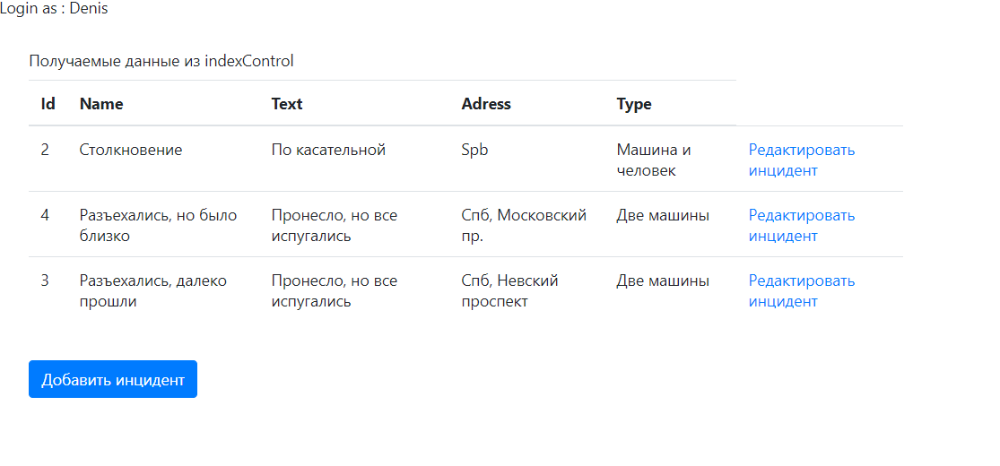
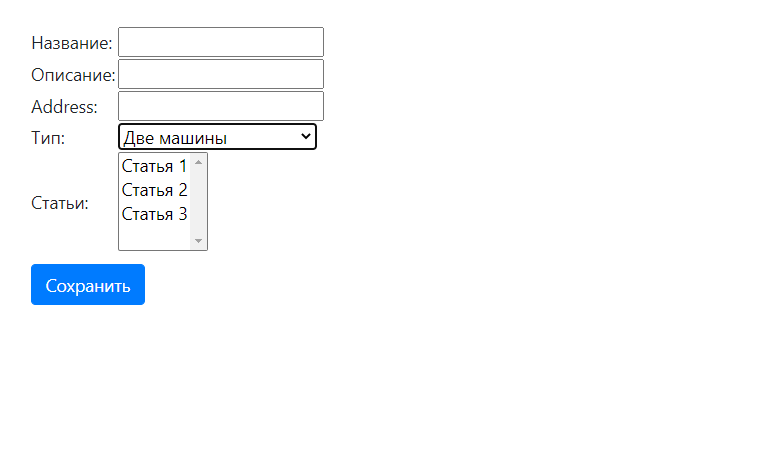
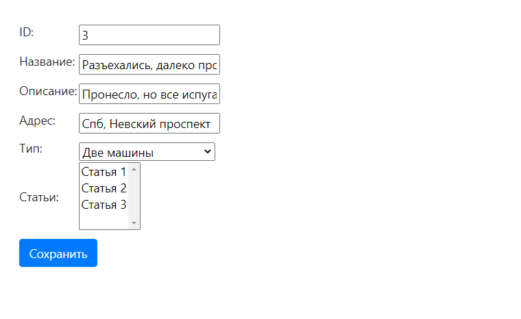
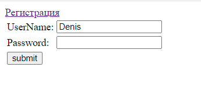
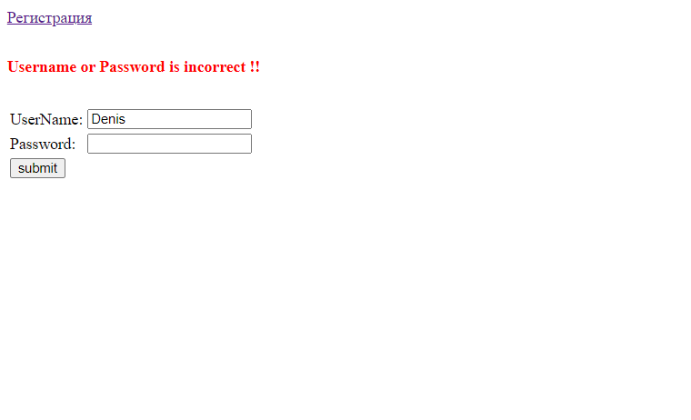

 
Проект - "регистрация автоинцидентов".
Веб приложение для учета автоинцидентов. Позволяет просматривать список автоинцидентов, добавлять новые
и редактировать уже сохраненные в базе данных.
Используемые технологии: Spring MVC, Hibernate ORM, Spring Data, Srping JDBC,  Srping Security, JSP, Bootstrap.
 

Вид стартовой страницы с применением Bootstrap

 

Вид страницы добавления новой записи

 
Вид страницы редактирования записи

 

Вид страницы авторизации

 

Вид страницы с неверными данными при авторизации

